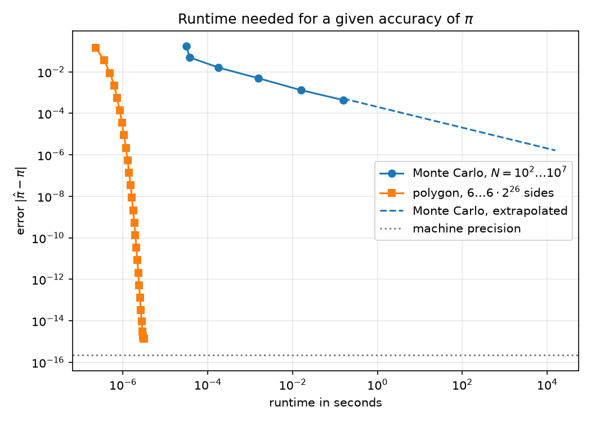

# Monte-Carlo-Schätzer für π – Gedanken und Vorgehen

Übung 0, Aufgabe 2a · 07.10.2026

## Dateien

| Datei | Inhalt |
|---|---|
| `test_monte_carlo_pi.py` | Tests (zuerst geschrieben) |
| `monte_carlo_pi.py` | Schätzer + Skript für N = 10² … 10⁷ mit Plot |
| `error_vs_N.png` | Fehler gegen N |

Ausführen (aus diesem Ordner):

```bash
../.venv/bin/python -m pytest -v
```

```bash
../.venv/bin/python monte_carlo_pi.py
```

## 1. Die Methode

N gleichverteilte Punkte im Einheitsquadrat. Der Viertelkreis x² + y² ≤ 1 hat
die Fläche π/4, das Quadrat die Fläche 1. Also ist die Trefferwahrscheinlichkeit
p = π/4 und

    π̂ = 4 · Treffer / N

## 2. Wie testet man etwas Zufälliges?

Das war die eigentliche Überlegung. `assert abs(estimate_pi(1000) - pi) < 0.1`
wäre ein schlechter Test: Die Toleranz ist geraten, und ohne Seed schlägt er
irgendwann zufällig fehl.

Stattdessen nutze ich, dass die Statistik des Schätzers exakt bekannt ist.
Jeder Punkt ist ein Bernoulli-Versuch mit p = π/4, die Trefferzahl ist
binomialverteilt mit Varianz N·p·(1−p). Daraus folgt

    E[π̂] = π
    σ(N) = sqrt(π(4−π)/N) ≈ 1.64/√N

Damit ergeben sich die Toleranzen aus der Theorie statt aus dem Bauch:

| Test | Was wird geprüft | Toleranz |
|---|---|---|
| bekannte Punkte | Geometrie `is_inside`, inkl. Randpunkt (0.6, 0.8) | exakt |
| Zahl vom Angabeblatt | 4·1188/1500 = 3.168 | exakt |
| gleicher / anderer Seed | Reproduzierbarkeit | exakt |
| Vielfaches von 4/N | Ergebnis kommt wirklich aus einer ganzzahligen Trefferzahl | exakt |
| N ≤ 0 | `ValueError` | – |
| \|π̂ − π\| für N = 10² … 10⁶ | Ergebnis stimmt | 5σ(N) |
| Mittelwert über 2000 Läufe | kein systematischer Fehler (Bias) | 5 Standardfehler |
| RMS-Fehler über 400 Läufe | Streuung = σ(N) | 15 % (statistische Unsicherheit ≈ 3.5 %) |
| Verhältnis RMS(10²)/RMS(10⁴) | Skalierung 1/√N, erwartet 10 | 20 % |

Alle Zufallstests haben feste Seeds, sind also deterministisch.

Dafür habe ich den Code in drei kleine Funktionen geteilt: `is_inside`
(Geometrie) und `pi_from_hits` (Formel) sind ohne Zufall und exakt testbar,
nur `estimate_pi` würfelt.

## 3. Ablauf

1. Tests geschrieben, laufen lassen → Fehler `ModuleNotFoundError` (wie erwartet, es gab noch keinen Code).
2. `monte_carlo_pi.py` geschrieben → 17 von 17 Tests grün.
3. **Test der Tests:** Ein grüner Test sagt nichts, wenn er auch bei falschem
   Code grün wäre. Deshalb habe ich absichtlich Fehler eingebaut (in einer Kopie):

   | Eingebauter Fehler | Ergebnis |
   |---|---|
   | `x + y <= 1` statt Kreis | 10 Tests rot ✔ |
   | Faktor 3.15 statt 4 | 11 Tests rot ✔ |
   | `y = x` (korrelierte Koordinaten) | 8 Tests rot ✔ |
   | Radius² = 1.002 statt 1 | **alle grün ✘** |

   Der letzte Fall zeigt die Grenze: Ein Fehler von 0.2 % in π̂ (≈ 0.006) liegt
   unter der 5σ-Schranke beim größten getesteten N (5σ(10⁶) ≈ 0.008). Die
   Tests garantieren also Korrektheit nur bis ca. 0.25 %. Für mehr müsste man
   mit größerem N testen (langsamer).

## 4. Ergebnis

| N | Einzellauf | RMS (20 Läufe) | Theorie σ(N) |
|---:|---:|---:|---:|
| 10² | 4.22e-01 | 1.75e-01 | 1.64e-01 |
| 10³ | 2.64e-02 | 4.99e-02 | 5.19e-02 |
| 10⁴ | 2.16e-02 | 1.62e-02 | 1.64e-02 |
| 10⁵ | 5.43e-03 | 4.93e-03 | 5.19e-03 |
| 10⁶ | 4.01e-04 | 1.32e-03 | 1.64e-03 |
| 10⁷ | 3.84e-04 | 4.39e-04 | 5.19e-04 |

Gefittete Steigung im log-log-Plot: **−0.52** (erwartet −0.5).


Beobachtungen:

- Der Fehler eines **einzelnen** Laufs ist selbst zufällig und fällt nicht
  monoton: von 10³ auf 10⁴ wird er kaum kleiner (2.6e-2 → 2.2e-2). Ein Plot mit
  nur einem Lauf pro N wäre irreführend. Deshalb 20 Läufe pro N und der
  RMS-Wert; die Einzelläufe sind grau eingezeichnet.
- Bei 10⁶ und 10⁷ liegt der RMS 15–20 % unter der Theorie. Das ist kein Effekt,
  sondern Rauschen: Ein RMS aus 20 Läufen hat eine relative Unsicherheit von
  1/√(2·20) ≈ 16 %.
- Warum 1/√N: π̂ ist ein Mittelwert aus N unabhängigen Zufallszahlen. Die
  Varianz einer Summe unabhängiger Größen wächst mit N, nach Division durch N
  bleibt Varianz ∝ 1/N, also Fehler ∝ 1/√N. Eine Stelle mehr Genauigkeit kostet
  100-mal mehr Punkte.

## 5. Entscheidungen, die nicht in der Angabe standen

- **Virtuelle Umgebung `.venv`** im Repo-Root: Keine der vier
  Python-Installationen auf dem Rechner hatte numpy/scipy/matplotlib/pytest.
  Statt global zu installieren: lokales venv (Python 3.14, numpy 2.5.3,
  scipy 1.18.1, matplotlib 3.11.2, pytest 9.1.1).
- **`.gitignore`** für `.venv/`, `__pycache__/`, `.pytest_cache/`, `.DS_Store`.
- **Gleich mit numpy vektorisiert** statt mit Python-Schleife. Aufgabe 2c
  (Vergleich mit Schleife) ist damit noch offen, die Schleifenversion fehlt.
- **Speicher:** Für N = 10⁷ werden alle Punkte auf einmal erzeugt (ca. 250 MB
  kurzzeitig). Für 10⁷ in Ordnung, für 10⁹ müsste man in Blöcken rechnen.
- **Randpunkte** (x² + y² = 1) zählen als innen. Für das Ergebnis egal, der
  Rand hat Fläche 0.
- **Nicht committet** – das ist laut Angabe (2b) der eigene Schritt nach dem
  Lesen des Codes.

---

# Erweiterung: Mehrecksmethode und Laufzeitvergleich

## Neue Dateien

| Datei | Inhalt |
|---|---|
| `polygon_pi.py` | Mehrecksmethode nach Archimedes |
| `test_polygon_pi.py` | Tests dazu (zuerst geschrieben) |
| `compare_methods.py` | Laufzeitvergleich beider Methoden mit Plot |
| `test_compare_methods.py` | Tests der Hilfsfunktionen des Vergleichs |
| `error_vs_runtime.png` | Fehler gegen Laufzeit |

```bash
../.venv/bin/python compare_methods.py
```

## 6. Die Mehrecksmethode

Ein regelmäßiges n-Eck im Einheitskreis hat einen kleineren Umfang als der
Kreis, ein umbeschriebenes einen größeren. Für die halben Umfänge gilt

    unten = n·sin(π/n)  <  π  <  n·tan(π/n) = oben

Die naheliegende Implementierung `n * sin(pi / n)` wäre ein Zirkelschluss: Sie
braucht π, um π zu berechnen. Deshalb das Verfahren von Archimedes: Start beim
Sechseck (unten = 3, oben = 2√3, elementar bekannt), dann Seitenzahl verdoppeln:

    oben_2n  = 2·oben·unten / (oben + unten)     (harmonisches Mittel)
    unten_2n = sqrt(oben_2n · unten)             (geometrisches Mittel)

Das braucht nur +, ·, / und Wurzel. Außerdem gibt es keine Differenz fast
gleicher Zahlen (die bekannte Variante mit `sqrt(4 - s²)` verliert dadurch bei
vielen Seiten wieder Stellen).

Angenehme Eigenschaft: Die Methode liefert eine untere **und** eine obere
Schranke. Man kennt den Fehler also, ohne π zu kennen. Als Schätzwert verwende
ich die untere Schranke (eingeschriebenes Vieleck).

Fehler: ∝ 1/n². Jede Verdopplung viertelt den Fehler, das sind 0.6 Stellen pro
Schritt.

## 7. Wie misst man die Laufzeit?

- `time.perf_counter()` vor und nach dem Aufruf.
- Ein Aufruf der Mehrecksmethode dauert etwa eine Mikrosekunde. Das ist zu kurz
  für eine einzelne Messung, deshalb 1000 Aufrufe hintereinander und durch 1000
  teilen.
- Das Ganze 5-mal, davon das **Minimum**: Andere Programme können einen Lauf
  nur langsamer machen, nie schneller.
- „Richtige Stellen“ definiere ich als −log₁₀(Fehler): Fehler 10⁻⁵ ↔ 5 Stellen.
- Bei Monte Carlo ist der Fehler zufällig, deshalb wie zuvor der RMS über
  20 Läufe.

## 8. Ergebnis des Vergleichs

Gemessen (Laufzeiten gelten für diesen Rechner, die Fehler nicht):

| Monte Carlo N | Fehler (RMS) | Stellen | Laufzeit |
|---:|---:|---:|---:|
| 10² | 1.75e-01 | 0.8 | 30 µs |
| 10³ | 4.99e-02 | 1.3 | 38 µs |
| 10⁴ | 1.62e-02 | 1.8 | 178 µs |
| 10⁵ | 4.93e-03 | 2.3 | 1.6 ms |
| 10⁶ | 1.32e-03 | 2.9 | 16 ms |
| 10⁷ | 4.39e-04 | 3.4 | 156 ms |

| Vieleck, Seiten | Fehler | Stellen | Laufzeit |
|---:|---:|---:|---:|
| 6 | 1.42e-01 | 0.8 | 0.23 µs |
| 96 | 5.61e-04 | 3.3 | 0.73 µs |
| 6 144 | 1.37e-07 | 6.9 | 1.4 µs |
| 393 216 | 3.34e-11 | 10.5 | 2.1 µs |
| 25 165 824 | 9.33e-15 | 14.0 | 2.8 µs |
| 402 653 184 | 1.33e-15 | 14.9 | 3.2 µs |

Laufzeit, um einen Fehler unter 10⁻ᵈ zu erreichen:

| d | Vieleck | Monte Carlo | |
|---:|---:|---:|---|
| 1 | 0.36 µs | 32 µs | gemessen |
| 2 | 0.49 µs | 0.44 ms | gemessen |
| 3 | 0.73 µs | 42 ms | gemessen |
| 4 | 0.95 µs | 4.2 s | hochgerechnet |
| 6 | 1.3 µs | 12 Stunden | hochgerechnet |
| 8 | 1.6 µs | 13 Jahre | hochgerechnet |
| 14 | 2.8 µs | 10¹³ Jahre | hochgerechnet |

Endergebnis:

    exakt                          π = 3.141592653589793
    Monte Carlo, N = 10⁷           π = 3.1421564            Fehler 5.6e-04, 156 ms
    Vieleck, 402 653 184 Seiten    π = 3.141592653589792    Fehler 1.3e-15, 3.2 µs



Beobachtungen:

- **Der Unterschied liegt in der Skalierung, nicht in einem Faktor.**
  Monte Carlo: Fehler ∝ 1/√N, Laufzeit ∝ N. Eine Stelle mehr kostet die
  100-fache Laufzeit. Vieleck: Fehler ∝ 4⁻ᵏ, Laufzeit ∝ k. Eine Stelle mehr
  kostet 1.7 zusätzliche Schritte, also ca. 0.2 µs.
- **Ab 4 Stellen ist Monte Carlo hochgerechnet, nicht gemessen.** Für N > 10⁷
  nehme ich die gemessene Zeit pro Punkt (15.6 ns) mal die nötige Punktzahl.
  Die würde der Code so gar nicht schaffen (Speicher), siehe Punkt 5.
- **Das Vieleck endet bei 1.3e-15.** Ab 6·2²⁵ Seiten ändert sich das Ergebnis
  nicht mehr: Grenze der doppelten Genauigkeit (ca. 16 Stellen). 15 richtige
  Stellen werden deshalb nicht erreicht. Die Schranke unten < π < oben gilt
  numerisch nur bis 6·2²³ Seiten, danach verletzen Rundungsfehler sie.
- **Monte Carlo bei kleinem N:** 10² und 10³ Punkte dauern fast gleich lang
  (30 µs und 38 µs). Das ist der Fixaufwand für das Anlegen des
  Zufallsgenerators, nicht das Würfeln.
- **Ist der Vergleich fair?** Nicht ganz: Monte Carlo läuft vektorisiert in
  numpy (kompilierter Code), das Vieleck als reine Python-Schleife. Das
  benachteiligt das Vieleck, das trotzdem um Größenordnungen gewinnt.
- **Wozu dann Monte Carlo?** Für ein eindimensionales Problem wie π ist es die
  falsche Methode. Der Fehler 1/√N hängt aber nicht von der Dimension ab; bei
  hochdimensionalen Integralen gibt es oft nichts Besseres.

## 9. Was dabei schiefging

Ein Test war zunächst rot, obwohl der Code richtig war:
`test_error_shrinks_by_factor_4_per_doubling` verlangte Faktor 4 ± 5 % schon ab
dem Sechseck. Vom Sechseck zum Zwölfeck ist der Faktor aber 4.24, weil
Fehler ∝ 1/n² erst für große n gilt. Der Fehler lag im Test, ich habe ihn dort
korrigiert (Start beim Zwölfeck) und nicht den Code angepasst.

Insgesamt jetzt 62 Testfälle, alle grün.
