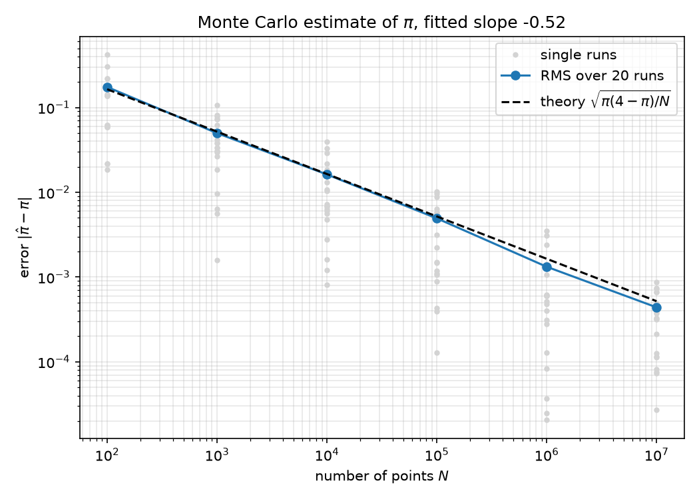

# Monte-Carlo-Schätzer für π – Gedanken und Vorgehen

Übung 0, Aufgabe 2a · 07.10.2026

## Dateien

| Datei | Inhalt |
|---|---|
| `test_monte_carlo_pi.py` | Tests (zuerst geschrieben) |
| `monte_carlo_pi.py` | Schätzer + Skript für N = 10² … 10⁷ mit Plot |
| `error_vs_N.png` | Fehler gegen N |

Ausführen (aus diesem Ordner):

```bash
../.venv/bin/python -m pytest -v
```

```bash
../.venv/bin/python monte_carlo_pi.py
```

## 1. Die Methode

N gleichverteilte Punkte im Einheitsquadrat. Der Viertelkreis x² + y² ≤ 1 hat
die Fläche π/4, das Quadrat die Fläche 1. Also ist die Trefferwahrscheinlichkeit
p = π/4 und

    π̂ = 4 · Treffer / N

## 2. Wie testet man etwas Zufälliges?

Das war die eigentliche Überlegung. `assert abs(estimate_pi(1000) - pi) < 0.1`
wäre ein schlechter Test: Die Toleranz ist geraten, und ohne Seed schlägt er
irgendwann zufällig fehl.

Stattdessen nutze ich, dass die Statistik des Schätzers exakt bekannt ist.
Jeder Punkt ist ein Bernoulli-Versuch mit p = π/4, die Trefferzahl ist
binomialverteilt mit Varianz N·p·(1−p). Daraus folgt

    E[π̂] = π
    σ(N) = sqrt(π(4−π)/N) ≈ 1.64/√N

Damit ergeben sich die Toleranzen aus der Theorie statt aus dem Bauch:

| Test | Was wird geprüft | Toleranz |
|---|---|---|
| bekannte Punkte | Geometrie `is_inside`, inkl. Randpunkt (0.6, 0.8) | exakt |
| Zahl vom Angabeblatt | 4·1188/1500 = 3.168 | exakt |
| gleicher / anderer Seed | Reproduzierbarkeit | exakt |
| Vielfaches von 4/N | Ergebnis kommt wirklich aus einer ganzzahligen Trefferzahl | exakt |
| N ≤ 0 | `ValueError` | – |
| \|π̂ − π\| für N = 10² … 10⁶ | Ergebnis stimmt | 5σ(N) |
| Mittelwert über 2000 Läufe | kein systematischer Fehler (Bias) | 5 Standardfehler |
| RMS-Fehler über 400 Läufe | Streuung = σ(N) | 15 % (statistische Unsicherheit ≈ 3.5 %) |
| Verhältnis RMS(10²)/RMS(10⁴) | Skalierung 1/√N, erwartet 10 | 20 % |

Alle Zufallstests haben feste Seeds, sind also deterministisch.

Dafür habe ich den Code in drei kleine Funktionen geteilt: `is_inside`
(Geometrie) und `pi_from_hits` (Formel) sind ohne Zufall und exakt testbar,
nur `estimate_pi` würfelt.

## 3. Ablauf

1. Tests geschrieben, laufen lassen → Fehler `ModuleNotFoundError` (wie erwartet, es gab noch keinen Code).
2. `monte_carlo_pi.py` geschrieben → 17 von 17 Tests grün.
3. **Test der Tests:** Ein grüner Test sagt nichts, wenn er auch bei falschem
   Code grün wäre. Deshalb habe ich absichtlich Fehler eingebaut (in einer Kopie):

   | Eingebauter Fehler | Ergebnis |
   |---|---|
   | `x + y <= 1` statt Kreis | 10 Tests rot ✔ |
   | Faktor 3.15 statt 4 | 11 Tests rot ✔ |
   | `y = x` (korrelierte Koordinaten) | 8 Tests rot ✔ |
   | Radius² = 1.002 statt 1 | **alle grün ✘** |

   Der letzte Fall zeigt die Grenze: Ein Fehler von 0.2 % in π̂ (≈ 0.006) liegt
   unter der 5σ-Schranke beim größten getesteten N (5σ(10⁶) ≈ 0.008). Die
   Tests garantieren also Korrektheit nur bis ca. 0.25 %. Für mehr müsste man
   mit größerem N testen (langsamer).

## 4. Ergebnis

| N | Einzellauf | RMS (20 Läufe) | Theorie σ(N) |
|---:|---:|---:|---:|
| 10² | 4.22e-01 | 1.75e-01 | 1.64e-01 |
| 10³ | 2.64e-02 | 4.99e-02 | 5.19e-02 |
| 10⁴ | 2.16e-02 | 1.62e-02 | 1.64e-02 |
| 10⁵ | 5.43e-03 | 4.93e-03 | 5.19e-03 |
| 10⁶ | 4.01e-04 | 1.32e-03 | 1.64e-03 |
| 10⁷ | 3.84e-04 | 4.39e-04 | 5.19e-04 |

Gefittete Steigung im log-log-Plot: **−0.52** (erwartet −0.5).



Beobachtungen:

- Der Fehler eines **einzelnen** Laufs ist selbst zufällig und fällt nicht
  monoton: von 10³ auf 10⁴ wird er kaum kleiner (2.6e-2 → 2.2e-2). Ein Plot mit
  nur einem Lauf pro N wäre irreführend. Deshalb 20 Läufe pro N und der
  RMS-Wert; die Einzelläufe sind grau eingezeichnet.
- Bei 10⁶ und 10⁷ liegt der RMS 15–20 % unter der Theorie. Das ist kein Effekt,
  sondern Rauschen: Ein RMS aus 20 Läufen hat eine relative Unsicherheit von
  1/√(2·20) ≈ 16 %.
- Warum 1/√N: π̂ ist ein Mittelwert aus N unabhängigen Zufallszahlen. Die
  Varianz einer Summe unabhängiger Größen wächst mit N, nach Division durch N
  bleibt Varianz ∝ 1/N, also Fehler ∝ 1/√N. Eine Stelle mehr Genauigkeit kostet
  100-mal mehr Punkte.

## 5. Entscheidungen, die nicht in der Angabe standen

- **Virtuelle Umgebung `.venv`** im Repo-Root: Keine der vier
  Python-Installationen auf dem Rechner hatte numpy/scipy/matplotlib/pytest.
  Statt global zu installieren: lokales venv (Python 3.14, numpy 2.5.3,
  scipy 1.18.1, matplotlib 3.11.2, pytest 9.1.1).
- **`.gitignore`** für `.venv/`, `__pycache__/`, `.pytest_cache/`, `.DS_Store`.
- **Gleich mit numpy vektorisiert** statt mit Python-Schleife. Aufgabe 2c
  (Vergleich mit Schleife) ist damit noch offen, die Schleifenversion fehlt.
- **Speicher:** Für N = 10⁷ werden alle Punkte auf einmal erzeugt (ca. 250 MB
  kurzzeitig). Für 10⁷ in Ordnung, für 10⁹ müsste man in Blöcken rechnen.
- **Randpunkte** (x² + y² = 1) zählen als innen. Für das Ergebnis egal, der
  Rand hat Fläche 0.
- **Nicht committet** – das ist laut Angabe (2b) der eigene Schritt nach dem
  Lesen des Codes.
