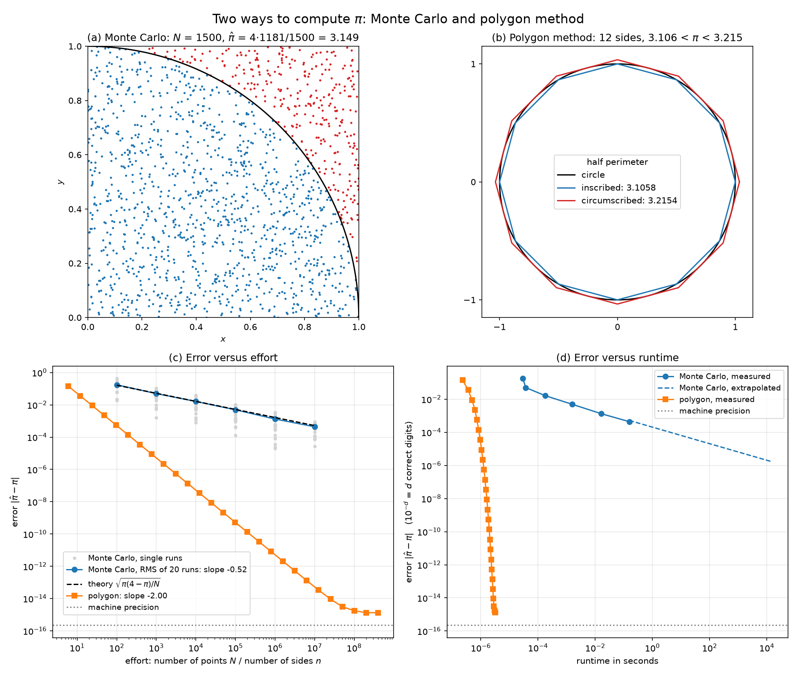

# Ergebnisse: π mit Monte Carlo und mit der Mehrecksmethode

Computational Physics · Übung 0 · 07.10.2026

## Kurzfassung

| | Monte Carlo | Mehrecksmethode |
|---|---|---|
| Bestes Ergebnis | 3.1419768 | 3.141592653589792 |
| Fehler | 3.8 · 10⁻⁴ | 1.3 · 10⁻¹⁵ |
| Richtige Stellen | 3 | 15 |
| Aufwand | 10⁷ Punkte | 402 653 184 Seiten (26 Verdopplungen) |
| Laufzeit | 156 ms | 3.2 µs |
| Fehler in Abhängigkeit vom Aufwand | ∝ N^−0.52 (Theorie −0.5) | ∝ n^−2.00 (Theorie −2) |
| Eine Stelle mehr kostet | 100-fache Laufzeit | ca. 0.2 µs |

Exakter Wert zum Vergleich: π = 3.141592653589793.

Die Mehrecksmethode ist 50 000-mal schneller und dabei um 11 Größenordnungen
genauer. Der Abstand wächst mit jeder weiteren Stelle.



## 1. Die zwei Methoden

**Monte Carlo (Bild a).** N zufällige Punkte im Einheitsquadrat. Der Anteil im
Viertelkreis nähert die Fläche π/4 an:

    π̂ = 4 · Treffer / N

Im Bild: 1181 von 1500 Punkten liegen innen, das ergibt π̂ = 3.149.

**Mehrecksmethode nach Archimedes (Bild b).** Der Kreisumfang liegt zwischen
dem Umfang eines eingeschriebenen und eines umbeschriebenen regelmäßigen
Vielecks. Man startet beim Sechseck (halbe Umfänge 3 und 2√3) und verdoppelt
die Seitenzahl:

    oben_2n  = 2 · oben · unten / (oben + unten)
    unten_2n = sqrt(oben_2n · unten)

Im Bild das Zwölfeck: 3.106 < π < 3.215. Die Methode liefert immer eine untere
und eine obere Schranke, der Fehler ist also bekannt, ohne π zu kennen.

## 2. Fehler in Abhängigkeit vom Aufwand (Bild c)

### Monte Carlo

| N | Fehler (RMS aus 20 Läufen) | Theorie | Stellen |
|---:|---:|---:|---:|
| 10² | 1.75 · 10⁻¹ | 1.64 · 10⁻¹ | 0.8 |
| 10³ | 4.99 · 10⁻² | 5.19 · 10⁻² | 1.3 |
| 10⁴ | 1.62 · 10⁻² | 1.64 · 10⁻² | 1.8 |
| 10⁵ | 4.93 · 10⁻³ | 5.19 · 10⁻³ | 2.3 |
| 10⁶ | 1.32 · 10⁻³ | 1.64 · 10⁻³ | 2.9 |
| 10⁷ | 4.39 · 10⁻⁴ | 5.19 · 10⁻⁴ | 3.4 |

Gefittete Steigung im log-log-Plot: **−0.52**.

Warum 1/√N: Jeder Punkt ist ein Treffer mit Wahrscheinlichkeit p = π/4. Die
Trefferzahl ist binomialverteilt mit Varianz N·p·(1−p). Daraus folgt für den
Schätzer die Standardabweichung

    σ(N) = sqrt(π(4−π)/N) ≈ 1.64/√N

Die gemessenen Fehler liegen auf dieser Kurve (gestrichelt in Bild c). Die
Abweichungen von bis zu 20 % bei 10⁶ und 10⁷ sind Rauschen: Ein RMS aus
20 Läufen ist selbst nur auf etwa 16 % genau.

Der Fehler eines einzelnen Laufs (graue Punkte) streut über mehr als eine
Größenordnung. Aus einem Lauf pro N lässt sich die Skalierung nicht ablesen.

### Mehrecksmethode

| Seiten n | Verdopplungen | Fehler | Stellen |
|---:|---:|---:|---:|
| 6 | 0 | 1.42 · 10⁻¹ | 0.8 |
| 96 | 4 | 5.61 · 10⁻⁴ | 3.3 |
| 6 144 | 10 | 1.37 · 10⁻⁷ | 6.9 |
| 196 608 | 15 | 1.34 · 10⁻¹⁰ | 9.9 |
| 6 291 456 | 20 | 1.32 · 10⁻¹³ | 12.9 |
| 100 663 296 | 24 | 1.78 · 10⁻¹⁵ | 14.8 |
| 402 653 184 | 26 | 1.33 · 10⁻¹⁵ | 14.9 |

Gefittete Steigung: **−2.00**. Der Fehler fällt wie 1/n², jede Verdopplung
viertelt ihn (0.6 Stellen pro Schritt).

Ab 25 Verdopplungen ändert sich das Ergebnis nicht mehr. Das ist die Grenze
der doppelten Genauigkeit (ca. 16 Stellen), nicht der Methode.

## 3. Laufzeit (Bild d)

Laufzeit, um einen Fehler unter 10⁻ᵈ zu erreichen:

| d | Mehrecksmethode | Monte Carlo | |
|---:|---:|---:|---|
| 1 | 0.36 µs | 32 µs | gemessen |
| 2 | 0.49 µs | 0.44 ms | gemessen |
| 3 | 0.73 µs | 42 ms | gemessen |
| 4 | 0.95 µs | 4.2 s | hochgerechnet |
| 5 | 1.1 µs | 7 Minuten | hochgerechnet |
| 6 | 1.3 µs | 12 Stunden | hochgerechnet |
| 8 | 1.6 µs | 13 Jahre | hochgerechnet |
| 10 | 2.1 µs | 10⁵ Jahre | hochgerechnet |
| 14 | 2.8 µs | 10¹³ Jahre | hochgerechnet |
| 15 | nicht erreicht | 10¹⁵ Jahre | hochgerechnet |

Der Unterschied ist keine Frage eines konstanten Faktors, sondern der
Skalierung:

- **Monte Carlo:** Fehler ∝ 1/√N, Laufzeit ∝ N. Also Laufzeit ∝ 1/Fehler².
  Eine Stelle mehr braucht 100-mal so lang.
- **Mehrecksmethode:** Fehler ∝ 4⁻ᵏ, Laufzeit ∝ k (Zahl der Verdopplungen).
  Eine Stelle mehr braucht 1.7 Schritte zusätzlich.

## 4. Wie die Ergebnisse geprüft wurden

- **62 automatische Tests**, alle bestanden. Sie wurden jeweils vor dem Code
  geschrieben. Einzeln erklärt in `TESTS.md`.
- **Monte Carlo** wird gegen die theoretische Streuung σ(N) geprüft: Ergebnis
  innerhalb 5σ, kein Bias im Mittel über 2000 Läufe, Streuung und
  1/√N-Skalierung über 400 Läufe.
- **Mehrecksmethode** wird gegen drei unabhängige Referenzen geprüft: das von
  Hand berechnete Sechseck, die geschlossenen Formeln n·sin(π/n) und n·tan(π/n)
  auf 13 Stellen, und Archimedes’ Ergebnis 223/71 < π < 22/7 für das 96-Eck.
- **Test der Tests:** In Kopien des Codes wurden acht Fehler absichtlich
  eingebaut. Sieben wurden erkannt, einer nicht (siehe unten).

## 5. Einschränkungen

- **Monte Carlo ist nur bis N = 10⁷ gemessen** (3 Stellen). Alle Laufzeiten
  darüber sind hochgerechnet: gemessene Zeit pro Punkt (15.6 ns) mal nötige
  Punktzahl. Der Code würde so große N nicht schaffen, weil er alle Punkte
  gleichzeitig im Speicher hält.
- **Die Laufzeiten gelten für diesen Rechner** und schwanken von Lauf zu Lauf
  um einige Prozent. Die Fehlerwerte sind durch feste Seeds exakt
  reproduzierbar.
- **Der Vergleich benachteiligt die Mehrecksmethode:** Monte Carlo läuft
  vektorisiert in numpy, das Vieleck als reine Python-Schleife. Am Ergebnis
  ändert das nichts.
- **Die Monte-Carlo-Tests erkennen systematische Fehler erst ab ca. 0.25 %.**
  Ein absichtlich eingebauter Fehler von 0.2 % (Radius² = 1.002) blieb
  unentdeckt.
- **15 Stellen sind mit doppelter Genauigkeit nicht erreichbar.** Die
  Mehrecksmethode bleibt bei einem Fehler von 1.3 · 10⁻¹⁵ stehen.
- **Monte Carlo bei kleinem N:** Die Laufzeit für 10² und 10³ Punkte ist fast
  gleich (31 µs und 38 µs), weil das Anlegen des Zufallsgenerators dominiert.

## 6. Fazit

Für π ist Monte Carlo die falsche Methode: Drei Stellen kosten 0.16 s, acht
Stellen würden Jahre dauern. Die Mehrecksmethode erreicht die volle
Rechnergenauigkeit in drei Mikrosekunden.

Der Wert von Monte Carlo liegt woanders: Die Konvergenz 1/√N hängt nicht von
der Dimension des Problems ab. Bei hochdimensionalen Integralen, wo
Gitterverfahren unbezahlbar werden, ist das oft die beste verfügbare Methode.

## Reproduzieren

Aus dem Ordner `2026-10-07`:

```bash
../.venv/bin/python -m pytest -v
```

```bash
../.venv/bin/python make_results_plot.py
```

| Datei | Inhalt |
|---|---|
| `monte_carlo_pi.py` | Monte-Carlo-Schätzer |
| `polygon_pi.py` | Mehrecksmethode |
| `compare_methods.py` | Laufzeitmessung und Tabelle „Laufzeit pro Stelle“ |
| `make_results_plot.py` | erzeugt `results.png` |
| `test_*.py` | Tests |
| `GEDANKEN.md` | Vorgehen und Überlegungen |
| `TESTS.md` | Erklärung der Tests |
